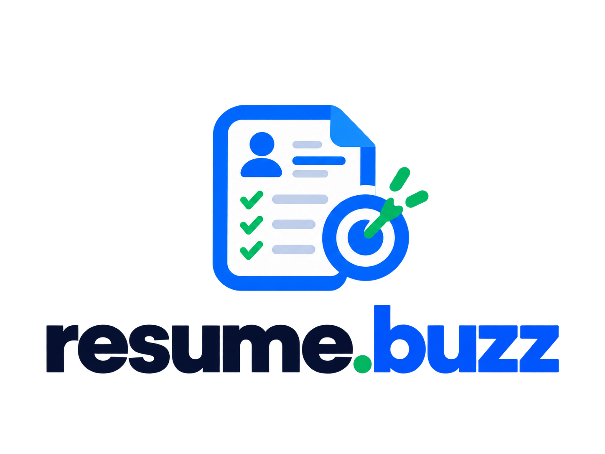
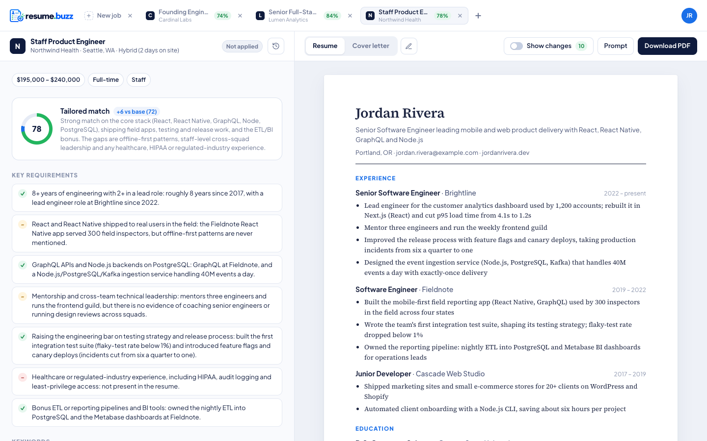
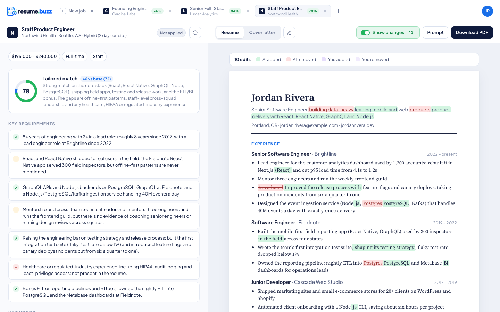
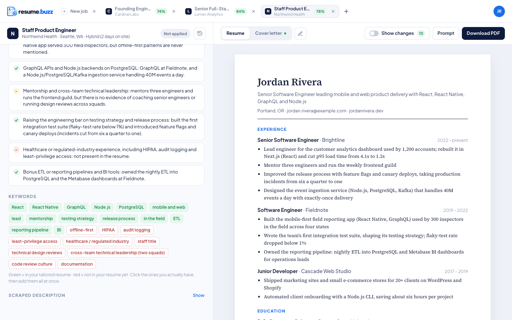
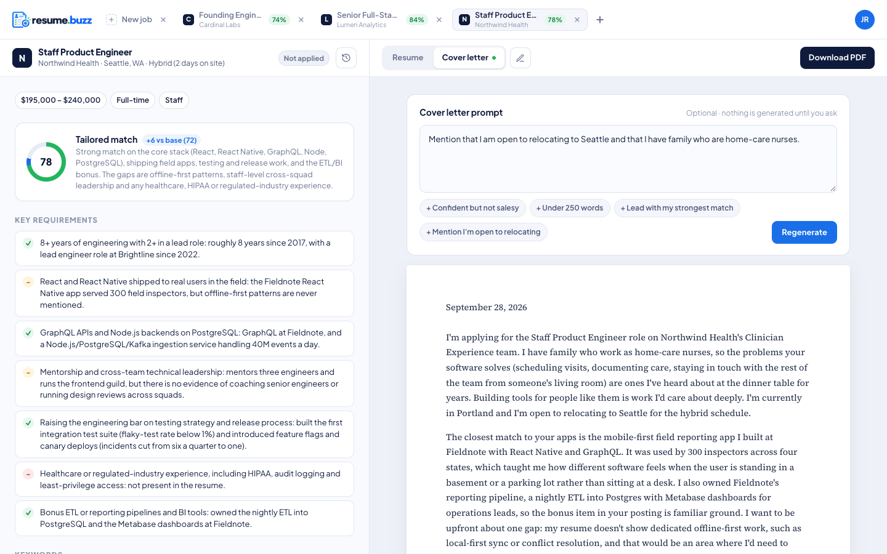
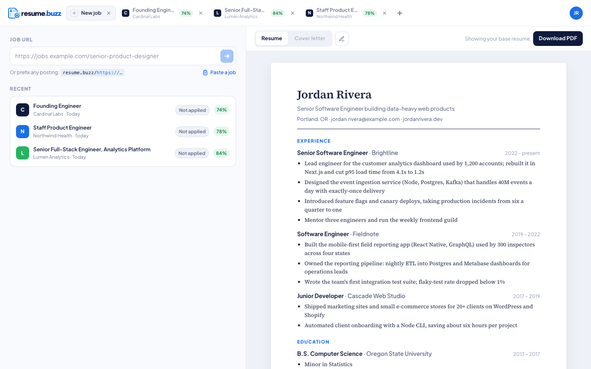
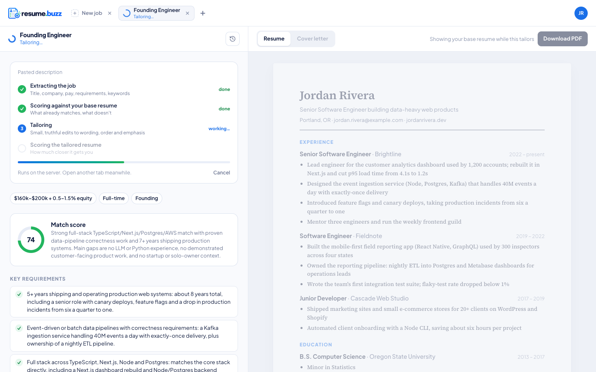
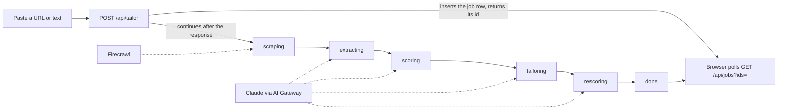

<p align="center">
  
</p>

<p align="center">
  Paste a job posting. Get your resume tailored to it, with a word-level diff of every change,
  an honest before/after match score, and a cover letter to go with it.
</p>

<p align="center">
  <a href="https://github.com/tylerclark/resume.buzz/actions/workflows/ci.yml"></a>
  <a href="LICENSE"></a>
  <a href="https://www.conventionalcommits.org/en/v1.0.0/"></a>
  
</p>

---

## Screenshots

Example data: a fictional candidate, three fictional postings.

<p align="center">
  
</p>

| Every change, word by word | Keywords you hit and the ones you can fill in |
| --- | --- |
|  |  |

| Cover letter from the tailored resume | Several jobs at once, each a tab |
| --- | --- |
|  |  |

<p align="center">
  
</p>

## What it does

You keep one **base resume**. For every job you paste in, resume.buzz:

1. **Fetches the posting** with Firecrawl (or takes pasted text for sites that block crawlers, like LinkedIn).
2. **Extracts** title, company, location, pay, level and a clean description.
3. **Scores** how well your base resume fits, requirement by requirement, with a note on why.
4. **Tailors** the resume: rewrites bullets and headline for that posting without inventing anything, keeping your sections, entries and dates exactly where they were.
5. **Rescores** the tailored version, so you see the real before/after number, not a vanity one.

Then you can:

- **See every change** as a three-way word-level diff (base → AI → you) and edit any line. Your edits are stored beside the AI text, so the diff always shows what you changed.
- **Fill gaps honestly.** Missing keywords are clickable. Describe where you actually used the skill, it is saved to your profile as confirmed experience, and the job is re-tailored with it. Never claims what you have not confirmed.
- **Write a cover letter** in your own voice from the tailored resume, then edit it as plain text.
- **Track applications.** Not applied → Applied → Interviewing → Offer → Rejected, with dates. **Already applied** covers postings that bounce you because an earlier application is still on file.
- **Export** a real PDF named `<Name> - Resume for <Company>`: styled, single-column, selectable text an ATS can read, with clickable email and links.
- **Import** your base resume from PDF or DOCX, or edit it in a structured editor that can reorder sections and entries.
- **Run several jobs at once.** Each job is a tab. The pipeline runs on the server after the request returns, so you can switch tabs, reload, or close the browser while it works. Failed jobs retry from the step that broke.
- **Demo it safely.** Demo mode in the account menu swaps your resume, jobs and email for a made-up profile with a few sample jobs already tailored (one of them submitted through the API), so you can show the app (with real postings) without showing your own details. Turn it off and everything of yours is back.

There is also a shortcut: prefix any posting URL with your instance, `resume.buzz/https://jobs.example.com/123`, and tailoring starts immediately.

A small detail that matters: every model output goes through a **style guard** that bans em dashes, ellipses and other tells of machine-written text, both in the prompt and with a post-processing scrub. The result reads like you wrote it.

## How it works



- **Background pipeline** (`src/lib/pipeline.ts`). Each stage writes its result to the `job` row before moving on, so a retry resumes rather than restarts. Cancelling is deleting the row: every stage write is conditional on the row existing, and the pipeline stops as soon as one write touches nothing. A pipeline that stops reporting for five minutes is shown as failed so nothing spins forever.
- **Structured output** (`src/lib/ai.ts`). Every model call returns a Zod-validated object via the Anthropic SDK's structured outputs, with adaptive thinking and a per-step effort level (low for extraction, high for tailoring).
- **Alignment guard** (`src/lib/align.ts`). The prompt asks the model to keep the base resume's order; the code then enforces it, so stored jobs always render in base order even if the model drifts.
- **Stale detection.** Each tailored resume stores a hash of the base it came from. Change your base resume and every affected job shows a banner with one-click re-tailor.
- **Auth** (`src/lib/auth.ts`). BetterAuth email one-time codes through Resend. OTPs are stored hashed. A fail-closed allowlist (`ALLOWED_EMAILS`) gates sign-in at the auth hook, not just in the email sender, because BetterAuth swallows errors thrown from the sender.
- **Tabs** (`src/components/tabs-store.tsx`). Open tabs live in localStorage per browser; the URL says which one is active, so plain links, bookmarks and the back button all work.

## API

Scripts and agents can submit jobs as leads. A submitted job waits in the app until you approve it; nothing is fetched or sent to the model (and no credits are spent) before that. Create a token under **account menu → API tokens** (shown once; only its SHA-256 is stored), then:

```sh
curl -X POST https://resume.buzz/api/jobs \
  -H "Authorization: Bearer rb_…" \
  -H "Content-Type: application/json" \
  -d '{"url": "https://jobs.example.com/123", "source": "my-agent", "notes": "Strong fit"}'
# → 202 {"id": "…", "stage": "pending", "link": "https://resume.buzz/j/…", "duplicate": false}
```

- **Body**: `url` and/or `description` (pasted posting text, 200+ chars), plus optional `title`, `company`, `notes`, `comp`, `priority`, `source` (a label shown in the app), `prompt`. Unknown fields are ignored. Send an array (or `{"jobs": […]}`) for up to 10 at once.
- **Dedupe**: a URL you already have (ignoring `utm_*` and similar tracking params) returns the existing job with `"duplicate": true`.
- **Company conflicts**: every response also carries `"companyConflict": true|false` and a `conflicts` list (`id`, `title`, `company`, `status`, `link`) of your jobs at the same employer (by company name, or by the posting's hostname for non-aggregator sites) with any status other than `not_applied`. The job is still created, since another role at the same company may be fine; an agent should check the flag and decide.
- **Status**: `GET /api/jobs?ids=a,b` with the same token. `stage` stays `pending` until you approve the job in the app, then goes `queued → scraping → extracting → scoring → tailoring → rescoring → done` (or `failed`).
- **List**: `GET /api/jobs?acted=1` (or `?status=applied,rejected,withdrawn,interviewing,offer,already_applied`, plus `q`, `sort`, `dir`, `offset`, `limit`) pages through your jobs. Each row includes `company`, `status` and `host` (the posting's hostname, lowercased, without `www.`), so an agent can skip employers you've already dealt with before pitching a role.
- **Limits**: 50 API jobs per rolling 24 hours per user. Tokens only work on `/api/jobs`.

In the app, submitted jobs sort to the top of Recent until opened and carry an **API** badge. Opening one shows who sent it, its notes, and **Tailor resume** / **Not interested**; once tailored, the same card offers **No longer interested** / **Mark applied**.

## Stack

| Layer | Choice |
| --- | --- |
| Framework | [Next.js 16](https://nextjs.org) App Router, React 19, Turbopack |
| Language | TypeScript (strict), [Zod 4](https://zod.dev) |
| Styling | [Tailwind CSS 4](https://tailwindcss.com) |
| Database | [Neon](https://neon.tech) Postgres via [Drizzle ORM](https://orm.drizzle.team) |
| Auth | [BetterAuth](https://www.better-auth.com) email OTP, [Resend](https://resend.com) for delivery |
| AI | Claude ([Opus 5.5](https://www.anthropic.com/claude) by default) through [Vercel AI Gateway](https://vercel.com/ai-gateway), Anthropic SDK structured outputs |
| Scraping | [Firecrawl](https://firecrawl.dev) |
| Imports | [mammoth](https://github.com/mwilliamson/mammoth.js) for DOCX, Claude's native PDF reading for PDF |
| Diff | [diff](https://github.com/kpdecker/jsdiff) (word-level) |
| Hosting | [Vercel](https://vercel.com) |

## Self-hosting

You need accounts on Neon, Resend, Firecrawl and Vercel (for the AI Gateway key). All four have free tiers that cover personal use.

```sh
git clone https://github.com/tylerclark/resume.buzz.git
cd resume.buzz
corepack enable          # picks up pnpm from package.json
pnpm install
cp .env.example .env.local
```

Fill in `.env.local`:

| Variable | What it is |
| --- | --- |
| `DATABASE_URL` | Neon connection string |
| `BETTER_AUTH_SECRET` | `openssl rand -base64 32` |
| `BETTER_AUTH_URL` | Public origin, `http://localhost:4719` locally |
| `RESEND_API_KEY`, `EMAIL_FROM` | Resend key and a sender on a verified domain |
| `ALLOWED_EMAILS` | Comma-separated list of who may sign in. **Empty means nobody**, so add yourself |
| `AI_GATEWAY_API_KEY` | Vercel AI Gateway key. On Vercel itself this can be blank; OIDC is used |
| `AI_GATEWAY_MODEL` | Optional. Defaults to `anthropic/claude-opus-5.5` |
| `FIRECRAWL_API_KEY` | Firecrawl key |

Then:

```sh
pnpm db:migrate          # applies drizzle/ migrations to your Neon database
pnpm dev                 # http://localhost:4719
```

Sign in with an email from `ALLOWED_EMAILS`, add your base resume (import a PDF or DOCX, or type it in), and paste a job.

### Deploy to Vercel

[](https://vercel.com/new/clone?repository-url=https%3A%2F%2Fgithub.com%2Ftylerclark%2Fresume.buzz&env=BETTER_AUTH_SECRET,BETTER_AUTH_URL,RESEND_API_KEY,EMAIL_FROM,ALLOWED_EMAILS,FIRECRAWL_API_KEY&project-name=resume-buzz&repository-name=resume.buzz)

Add the Neon integration from the Vercel marketplace to get `DATABASE_URL`, and the AI Gateway works with the deployment's OIDC token, so no key is needed there. Run `pnpm db:migrate` once against the production database.

## Development

```sh
pnpm dev          # dev server
pnpm check        # eslint + tsc, what the git hook and CI expect
pnpm build        # production build
pnpm db:generate  # after editing src/db/schema.ts
pnpm db:studio    # browse the database
```

Commits follow [Conventional Commits](https://www.conventionalcommits.org/en/v1.0.0/) and are checked by a `commit-msg` hook and in CI. See [CONTRIBUTING.md](CONTRIBUTING.md) for the types and scopes in use.

### Layout

```
src/
  app/
    (app)/            authenticated pages: new-job tab (/), job tab (/j/[id])
    [...jobUrl]/      the /https://… prefix shortcut
    api/              tailor, jobs, resume, facts, auth routes
    login/            email OTP sign-in
  components/         workspace, tabs, editors, resume renderer
  lib/
    ai.ts             every Claude and Firecrawl call, with the prompts
    pipeline.ts       background scrape → extract → score → tailor → rescore
    align.ts          keeps tailored output in base-resume order
    style.ts          the no-em-dash style guard
    types.ts          Zod schemas shared by API, DB and UI
    auth.ts           BetterAuth config and the allowlist
    demo.ts           demo mode: the sample resume and the shadow user that owns it
    data.ts           DB reads used by pages and the pipeline
  db/                 Drizzle schema and client
  proxy.ts            optimistic session-cookie redirect for app routes
drizzle/              SQL migrations
```

## Contributing

Issues and pull requests are welcome. Please read [CONTRIBUTING.md](CONTRIBUTING.md) first, and report security problems privately as described in [SECURITY.md](SECURITY.md). This project follows the [Contributor Covenant](CODE_OF_CONDUCT.md).

## License

[MIT](LICENSE) © Tyler Clark. Third-party material is listed in [THIRD_PARTY_NOTICES.md](THIRD_PARTY_NOTICES.md).
